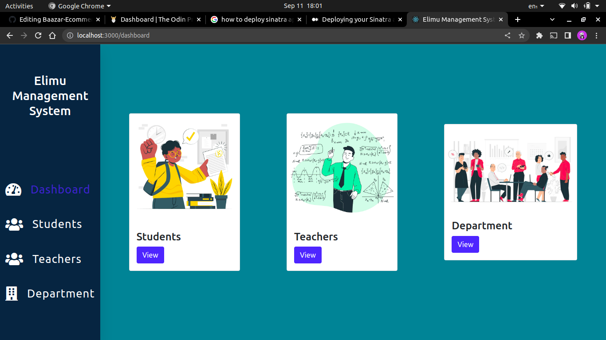
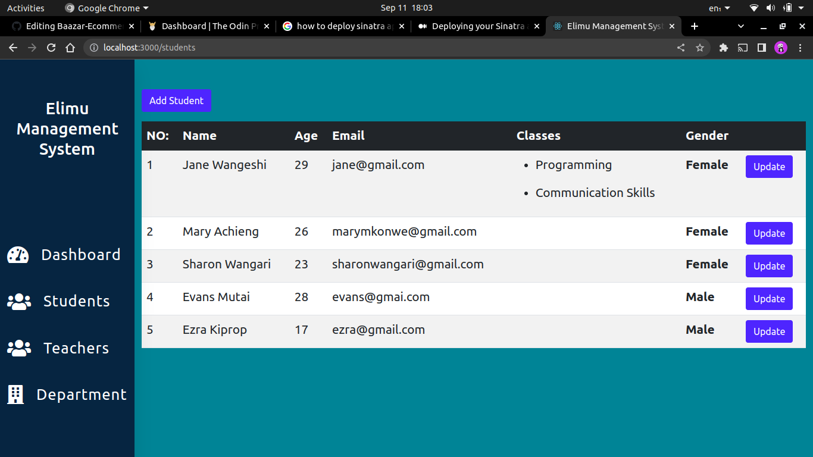
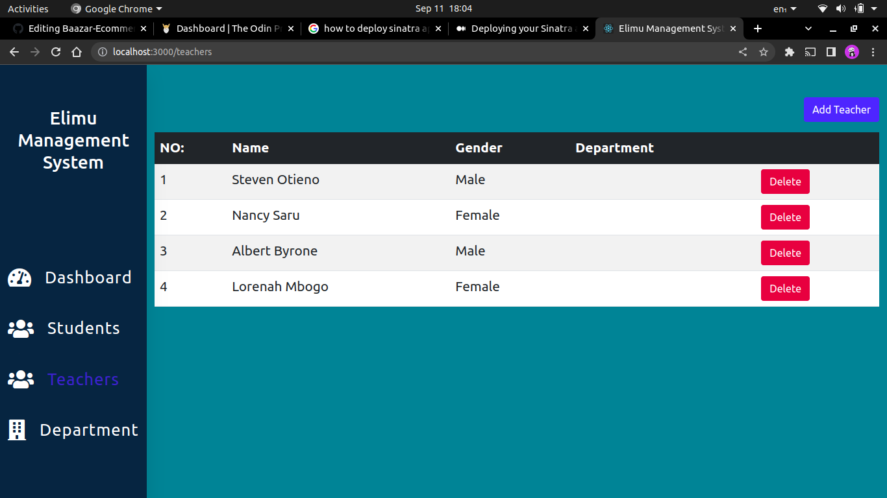
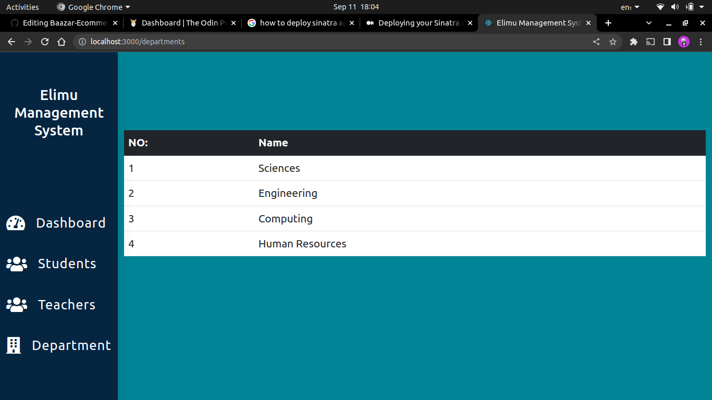

# Table of Contents
1. Project Name
2. Author
3. Description
4. Screenshots
5. Features
6. Technologies Used
7. Installation and setup instructions

# Project Name

 ## Elimu Management System
# Author
 Steven Otieno

## Description
 Elimu Management system is a web based application that enables the user to keep track of the students, teachers and their respective departments. One is able to add, delete and even update either a teacher and a student.

# Screenshots

### Dashboard Page Image

### Student Page Image

### Teacher Page Image

### Department Page Image

# Features

- One is able to add a teacher in the school system
- One 

# Technologies Used
- HTML
- CSS
- Javascript(REACT)
- Ruby
- Sinatra DSL

# Installation and Setup Instructions
### Requirements
- A web browser.
- A Text Editor(Visual Studio Code).
- An Internet Connection.

### Setup Instructions
- Clone the repository.

` git clone git@github.com:Zavi254/Elimu_Management-System.git`.
- Open the folder in your local machine in visual studio code
- To start the frontend , move to the frontend folder and the run `npm start.`
- To start the backend , move to the backend folder and the run `rake server.`

# Authors Info

[LinkedIn](https://www.linkedin.com/in/steven-otieno-6684431b3/)

# License

Copyright (c) 2022 Steven Otieno

Permission is hereby granted, free of charge, to any person obtaining a copy of this software and associated documentation files (the "Software"), to deal in the Software without restriction, including without limitation the rights to use, copy, modify, merge, publish, distribute, sublicense, and/or sell copies of the Software, and to permit persons to whom the Software is furnished to do so, subject to the following conditions:

The above copyright notice and this permission notice shall be included in all copies or substantial portions of the Software.

THE SOFTWARE IS PROVIDED "AS IS", WITHOUT WARRANTY OF ANY KIND, EXPRESS OR IMPLIED, INCLUDING BUT NOT LIMITED TO THE WARRANTIES OF MERCHANTABILITY, FITNESS FOR A PARTICULAR PURPOSE AND NONINFRINGEMENT. IN NO EVENT SHALL THE AUTHORS OR COPYRIGHT HOLDERS BE LIABLE FOR ANY CLAIM, DAMAGES OR OTHER LIABILITY, WHETHER IN AN ACTION OF CONTRACT, TORT OR OTHERWISE, ARISING FROM, OUT OF OR IN CONNECTION WITH THE SOFTWARE OR THE USE OR OTHER DEALINGS IN THE SOFTWARE.